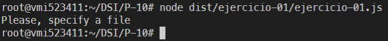
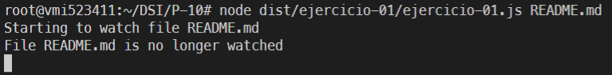
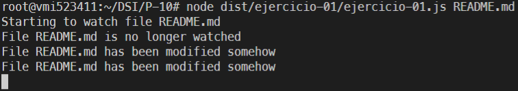
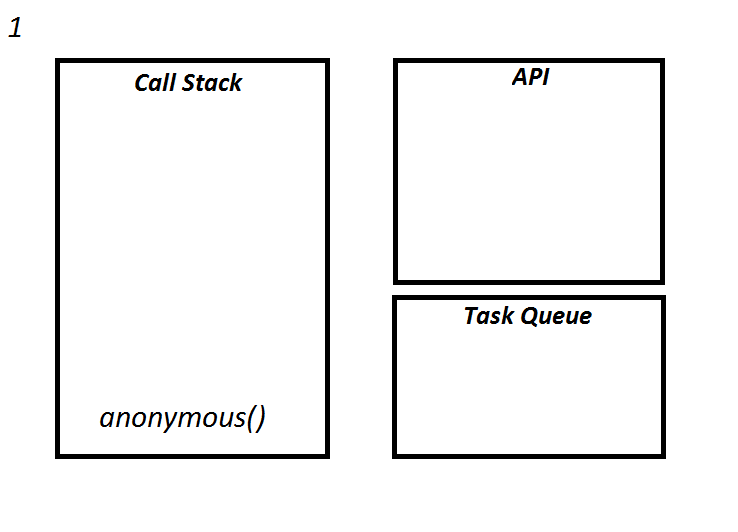

# Práctica 10 - Sistema de ficheros y creación de procesos en Node.js

## Introduccion 
En esta practica vamos a hacer uso de la libreria fs, child_process, stream y otros para manejar ficheros e informacion de los mismos.
Asi como lo que sucede en la CallStack, API y Task Queue.

***

## Ejercicio 1

### Ejecucion del programa

Si ejecutamos el programa con un archivo que no existe o sin archivo, nos indica por pantalla que especifiquemos un archivo. 

 <!-- Ejecutamos sin fichero a vigilar -->

En caso de que si existe, nos imprime por pantalla que el programa esta empezando a observar el archivo, para observar modificaciones en el. A continuacion imprime por pantalla que el archivo ya no esta siendo observado, se explicará mas adelante. 

 <!-- Ejecutamos con fichero a vigilar pero sin cambiar nada -->

Mientras tanto, si modificamos el archivo, nos muestra dos veces por pantalla que el archivo ha sido modificado, si lo volvemos a modificar, nos vuelvea mostrar el mismo mensaje por segunda vez. Acabamos la ejecucion del programa al ingresar por teclado ```ctrl + C```

 <!-- Ejecutamos con fichero a vigilar cambiando algo -->

### Contenido de Pila y registro de eventos.



1- Carga en la Call Stack la llamada del programa, que es anonima, despues de esto el programa comprueba si los argumentos son validos, en caso de que si guarda una variable filename el argumento recibido.

2- En este paso entra la funcion access() a la webAPI, se resuelve esta parte, dando fin a la funcion anonima y a la access.

3- Que dando asi en este paso en la Task Queen la callback de access.

4- En este punto se carga la funcion callback de access ya que la Call Stack esta vacia, y entra un console.log() que mostrará: ```Starting to watch file ${filename}``` y sale de la Call Stack.

5- En este punto se llama a la funcion watch que se guarda su contenido en watcher, finalizando asi.

6- Se carga la funcion watcher.on() en la webAPI.

7- Entra ahora a la Call Stack un console.log() que mostrara: ```File ${filename} is no longer watched```, cuando acabe sale de la Call Stack.

8- Pasa de la webAPI el watcher.on() a la Task Queen y termina la callback de acces.

9- Pasa la callback de watcher.on() a la Call Stack.

10- Entra un console.log() a la Call Stack, que mostrara: ```File ${filename} has been modified somehow```, finaliza y sale.

11- Se queda el callback de watcher.on() hasta que acabe el programa.

### __¿Qué hace la función access?__

La funcion access() se encarga de comprobar que el usuario tiene los permisos para acceder al archivo que se le pasa por parametro. Sin embargo, se le pasa como parametro tambien constants.F_OK, por lo tanto ahora, la funcion access nos dice solamente si el fichero existe en el path que le hemos pasado como primer parametro.

### __¿Para qué sirve el objeto constants?__

Son objetos que se usan en la funcion access, tenemos diferentes tipos:

_F_OK_: Nos dice si existe el path.

_R_OK_: Nos dice si tenemos permisos de lectura del path.

_W_OK_: Nos dice si tenemos permisos de escritura del path.

_X_OK_: Nos dice si tenemos permisos de ejecucuion del path.

***

## Ejercicio 2

En este ejercicio se nos pedia simular los comando cat y grep, proporcionando por argumentos al programa, el fichero y la palabra que tendriamos que buscar, pero ademas de esto, este se tenia que hacer de dos formas, una usando las _pipes_ y otro sin usarlas.

__Para el que usamos _pipes___:

Creamos dos procesos con `spawn` importado de `child_process` y el resultado del primero que era el cat se lo pasabamos al segundo a travez de la _pipe_

```ts
const cat = spawn('cat', [path]);
const grep = spawn('grep', [word])
cat.stdout.pipe(grep.stdin);
```

De esta forma el grep en su evento `"onData"` tiene las lineas de texto que contengan la palabra a buscar, y lo vamos concatenando apra guardarlo.

```ts
grep.stdout.on("data", (data)=>{
  stringData += data
})
grep.on('close', () => {
  ...
})
```

Una vez se activa el evento de `close` del grep, ya terminamos de recibir informacion, por lo cual ya podremos trabajar con el resultado, para contar la cantidad de veces que aparece la palabra que queriamos contar.

__Para el que usamos NO _pipes___:

Para este creamos dos procesos con el spawn, primero el cat que recibira la informacion del fichero y mediante el evento `"onData"` vamos escribiendo esta informacion en el buffer de entrada del segundo proceso, el grep, el cual tiene un evento `"onData"` que se encarga de ir concatenando toda la informacion que le llega, una vez termine el cat el `"onData"`, tendria que activarse el `"onClose"` que esto emitira otro evento que le indica al grep que ya termino de recibir informacion.

A continuacion el grep, activa su `"onClose"` permitiendo asi que se pueda trabajar con toda la informacion obtenida y buscar la palabra a contar.

```ts
const cat = spawn('cat', [path])
const grep = spawn('grep', [word])

cat.stdout.on('data', (data) => {
  grep.stdin.write(data)
})
cat.on('close', () => {
  grep.stdin.end()
})

grep.stdout.on('data', (data) => {
  stringData += data
})
grep.on('close', () => {
  ...
})
```

> La referencia a `"onData"` quiere decir:
>```ts
>proccess.stdout.on('data', (data) => {
>})
>```

***

## Ejercicio 3 
Se nos solicitaba el seguimiento de los ficheros de un usuario, basado en la Practica 9.

> Se a copiado el codigo compilado de la Practica 9 para que se pueda llevar a cabo la prueba de este ejercicio.

En este ejercicio pasandole un nombre de usuario, el programa tenia que notificar cualquier cambio en ese directorio con respecto a las notas del usuario.Para esto haciendo uso de los argumentos del proceso, comprobamos  que se nos pasa el nombre del usuario como 2 argumento.
```ts
if(process.argv[2] == undefined){
    console.log("Indique un Usuario.");
}
```
Cuando se le pasa el nombre de dicho usuario, compruebo que exista este usuario, comprobando si puedo acceder a la ruta.
```ts
access(`./database/${process.argv[2]}/`, constants.F_OK,(err) => {
    if (err) {
        console.log(`El usario ${process.argv[2]} no existe`);
    }
```
Una vez comprobado que el usuario existe, osea se puede acceder a su directorio, pongo en seguimiento esta ruta, mediante el uso del ```watch()```
```ts
watch(`./database/${process.argv[2]}/`, (eventType, filename) => {
        console.log("\nEl fichero", filename, "ha cambiado!");
        console.log("El cambio fue de tipo:", eventType);
    })
```

Cada vez que el se crea, modifica o elimina una nota del usuario, saldira en la consola el tipo de cambio y el fichero que cambio.

Con respecto a las perguntas finales, para ver el contenido del fichero que cambio, basta con tomar el nombre del fichero y hacer uso del spawn para invocar el comando `cat` sobre ese fichero y mostrar en la consola su contenido.

Con la segunda pregunta, para resolverlo planteado podriamos hacer uso de un paquete `npm` que se llama [Chokidar](https://www.npmjs.com/package/chokidar) que nos permite realizar todas esas acciones.

***

## Ejercicio 4
En este ejercicio se nos solicitaba que el programa realizara multipoles funciones tales como: 
* Compruba si path es un fichero o directorio.
* Crea un directorio en el path.
* Lista los ficheros dentro del path.
* Muestra el contenido del fichero que indica el path.
* Borra lo que indique el path.
* Mueve el contenido del path_origen a path_destino.
* Copia el contenido del path_origen a path_destino.

Para el desarrollo de este ejercicio, usamos los argumentos del proceso, prmero comprobamos que se le pasa al menos un argumento.
```ts
if (process.argv.length < 3) {
    console.log("Use help para la ayuda");
}
```
En caso de no indicar un argumento mostramos en la consola que use help para obtener ayuda, es aqui donde entra un ```switch()``` donde en cada `case` se comprueba el argumento idicado realizando ese fragmento de codigo.
Donde el codigo consta de 8 case, `help`, `check`, `mkdir`, `ll`, `cat`, `rm`, `mv`,`cp` y el default, para si indica un argumento que no este en la lista.

* El _`help`_ mustra una lista de opciones validas y lo que hace cada una.

* El _`check`_ comprobamos que se le pasa una ruta osea el argumento 3 del proceso, una vez comprobado, se llama a la funcion `spawn()` con la funcion ls y los argumentos -ld y la ruta, y su resultado lo guardamos en _check_, ahora mediante la stdout invocada por _check_ recogemos todos los datos entrante con el evento on data, y acumulamos el resultado en _res_check_, despues tomamos la primera posicion de esta variable, que al ser un string, es como tomar el primer caracter del string, y si es un "-" significa que es un fichero y en otro caso "d" es un directorio.

* El _`mkdir`_ comprobamos que se le indica una ruta, la cual es la que se va a crear, ya sabiendo que se le paso la ruta como argumento, se llama a la funcion `sapwn()` con la funcion mkdir y argumento la ruta indicada, creando asi el directorio, e imprimiendo en consola un mensaje de "Directorio creado".

* El _`ll`_ comprobamos que se le pasa una ruta como argumento 3, que sera la que se listara su contenido. Comprobamos que se puede acceder a dicha ruta si es satisfactorio, usamos un `spawn()` con al funcion ls y argumento -l y la ruta su resultado lo guardamos en _ll_ y mediante el uso de `pipe()` mostramos el contenido en la consola.

* El _`cat`_ comprobamos que se nos indica una ruta a un fichero, del cual mostraremos su contenido, comprobamos tambien que podemos acceder a dicho fichero y si todo es afirmativo, usamos `spawn()` con la funcion ls y como argumento la ruta del fichero, guardando esto en _ls_ y mediante el uso de `pipe()` mostramos el contenido en la consola.

* El _`rm`_ comprobamos que se nos indica una ruta, la cual borraremos, tambien comprobamos que existe esta ruta, para acontinuacion mediante el `spawn()` pasandole la funcion rm y como argumento del mismo -rf y la ruta, el -rf es para que borre todo indistinto de si es un directorio o fichero. cuando termina muestra un mensaje en la consola.

* El _`mv`_ y _`cp`_ son practicamento lo mismo, comprobamos que se pasa una ruta origen y una ruta destino, luego comprobamos el acceso a dichas rutas, para a continuacion llevar una comprobacion muy larga haciendo uso del _check_ del inicio, ya que no se puede copiar ni mover un directorio a un fichero, pues comprobamos que son cada ruta y si no son directorio hacia fichero, se llama al `spawn()` pasandole como funcion el mv o cp y argumento en caso de cp el -r para que sea una copia recursiva, y las dos ruta de origen y destino, al finalizar mostramos un mensaje en la consola.

***